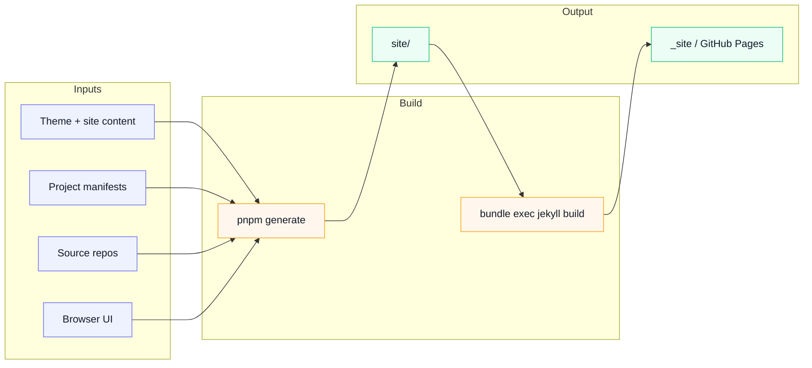

```mermaid
%%{init: {"theme": "default", "flowchart": {"curve": "basis"}}}%%
flowchart LR
  subgraph Inputs["Inputs"]
    direction TB
    theme["Theme + site content"]
    manifests["Project manifests"]
    sources["Source repos"]
    ui["Browser UI"]
  end

  subgraph Build["Build"]
    direction TB
    generate["pnpm generate"]
    jekyll["bundle exec jekyll build"]
  end

  subgraph Output["Output"]
    direction TB
    site["site/"]
    pages["_site / GitHub Pages"]
  end

  theme --> generate
  manifests --> generate
  sources --> generate
  ui --> generate
  generate --> site --> jekyll --> pages

  classDef input fill:#eef2ff,stroke:#6366f1,color:#111827;
  classDef process fill:#fff7ed,stroke:#f59e0b,color:#111827;
  classDef output fill:#ecfdf5,stroke:#10b981,color:#111827;

  class theme,manifests,sources,ui input;
  class generate,jekyll process;
  class site,pages output;
```
